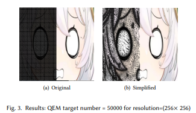

## Image-compression-and-vectorization-by-QEM

​	In this assignment, we implement 2D mesh on the image, simplify the image mesh based on QEM algorithm and compare the results under different target QEM number. 

## Run

```bash
mkdir build
cd build
cmake ..
cmake --build . --config Release -j
main.exe
```

## Result

